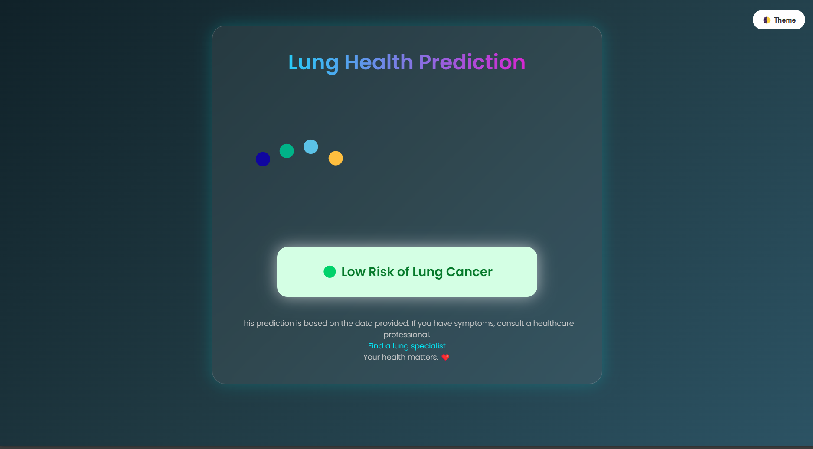

# 🫁 Lung Cancer Risk Prediction Web App

A user-friendly Flask web application that predicts lung cancer risk levels (**Low, Medium, High**) in real time using a TensorFlow/Keras multilayer perceptron (MLP) model — leveraging 23 clinical, lifestyle, and environmental factors.

---

## 🚀 Live Demo

👉 [View Deployed App](#)  

https://lung-cancer-prediction-using-deep-wcfa.onrender.com/

## 🔍 Overview

This project delivers an end-to-end solution for lung cancer risk assessment:

- **Data Collection:** Accepts 23 clinical, lifestyle, and environmental inputs.
- **Preprocessing:** Normalizes inputs with `StandardScaler`.
- **Prediction:** Classifies risk levels (Low, Medium, High) using a trained MLP model.
- **Visualization:** Interactive, responsive UI with engaging animations.

> **Why it matters:** Early risk estimation can guide users toward timely medical consultations.

---

## 🎯 Features

### 🌟 High-end UI
- ✨ Glassmorphism design
- 🌙 Dark/Light mode toggle
- 📽️ Scroll-based Lottie animations
- 📱 Fully responsive layout

### 🧠 Deep Learning
- Multilayer Perceptron (MLP) model
- StandardScaler preprocessing

### ⚙️ Real-time Prediction
- Powered by Flask backend
- Instant feedback on results page

### 📊 Training Visualization
- Model accuracy and loss graphs

### 🧪 Testing Mode
- Predefined dummy input script

### 💾 Model Artifacts
- Saved model: [`my_model.h5`](my_model.h5)
- Saved scaler: [`scaler.pkl`](scaler.pkl)

---

## 🚀 How It Works

1. 📝 **User Inputs**  
   Age, Gender, Smoking history, Air pollution exposure, Genetic risk, etc.

2. ⚙️ **Preprocessing**  
   Inputs are scaled using `StandardScaler`.

3. 🧠 **Prediction**  
   The MLP model predicts:  
   - **Low**, **Medium**, or **High** cancer risk.

4. 🎨 **Output**  
   Prediction displayed on a beautifully designed result screen with animations.

---

## 🎨 Tech Stack

| Layer        | Tools Used                                         |
|--------------|----------------------------------------------------|
| **Backend**  | [Flask](https://flask.palletsprojects.com/), [Python](https://www.python.org/), [Gunicorn](https://gunicorn.org/) |
| **Model**    | [TensorFlow](https://www.tensorflow.org/), [Keras](https://keras.io/), [scikit-learn](https://scikit-learn.org/) |
| **Frontend** | HTML5, CSS3, JavaScript                            |
| **Styling**  | [Bootstrap 5](https://getbootstrap.com/), Glassmorphism, Custom CSS |
| **Animations** | [Lottie](https://lottiefiles.com/), [AOS](https://michalsnik.github.io/aos/), [Particles.js](https://vincentgarreau.com/particles.js/) |

---

## ⚙️ Installation & Running Locally

# 1. Clone the repository
git clone https://github.com/bindu2607/Lung-Cancer-Prediction-Using-Deep-Learning
cd Lung-Cancer-Prediction-Using-Deep-Learning

# 2. (Optional) Create a virtual environment
python -m venv venv
source venv/bin/activate  # Windows: venv\Scripts\activate

# 3. Install dependencies
pip install -r requirements.txt

# 4. Start the Flask web application
python app.py

# 5. (Optional) Re-train the deep learning model
python train.py

# 6. (Optional) Run prediction tests using dummy inputs
python test.py

📄 License

This project is licensed under the MIT License. See the LICENSE file for details.

👩‍💻 Author

Marpini Himabindu
B.Tech in Information Technology (2022–2026)

